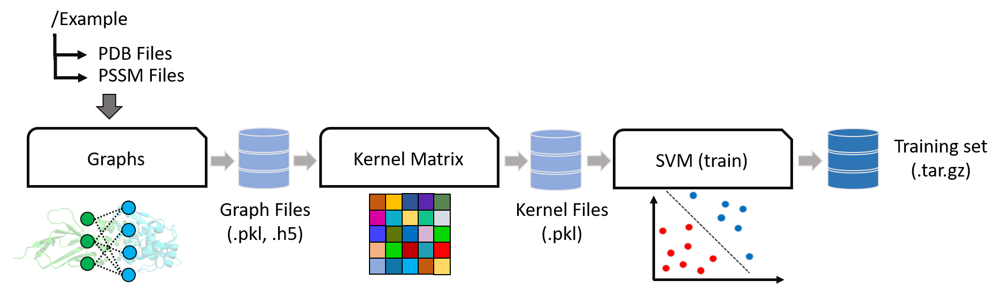

# iScore

**Support Vector Machine on Graph Kernel for Ranking Protein-Protein Docking Models**

[](https://travis-ci.org/DeepRank/iScore)
[](http://iscoredoc.readthedocs.io/?badge=latest)
[](https://coveralls.io/github/DeepRank/iScore?branch=master)
[](https://www.codacy.com/app/NicoRenaud/iScore?utm_source=github.com&amp;utm_medium=referral&amp;utm_content=DeepRank/iScore&amp;utm_campaign=Badge_Grade)
[](https://doi.org/10.5281/zenodo.2630567)




## 1. Installation

Minimal information to install the module
- Check if command `mpiexec` is available or not in your console. If not, download and install [openmpi](https://www.open-mpi.org/) or [mpich](https://www.mpich.org/).
- Install iScore using `pip install iScore`

Possible problems:
- If `pip install iScore` gives problems on installing `mpi4py`, try to first install `mpi4py` using `conda install mpi4py` and then `pip install iScore`.

## 2. Documentaion

The documentaion of the pacakge can be found at:
- https://iscoredoc.readthedocs.io


## 3. Quick Examples

iScore offers simple solutions to classify protein-protein interfaces using a support vector machine approach on graph kernels. The simplest way to use iScore is through dedicated binaries that hide the complexity of the approach and allows access to the code with simple command line interfaces. The two binaries are `iscore.train` and `iscore.predict` (`iscore.train.mpi` and `iscore.predict.mpi` for parallel running) that respectively train a model using a trainging set and use this model to rank the docking models of a protein-protein complex.

### Requirements for preparing data:

 - Use the following file structure
      ```
      root/
      |__train/
      |    |__ pdb/
      |    |__ pssm/
      |    |__ class.lst
      |__test/
            |__pdb/
            |__pssm/
            |__ class.lst (optional)
      ```
      The `pdb` folder contains the PDB files of docking models, and `pssm` contains the PSSM files. The `class.lst` is a list of class ID and PDB file name for each docking model, like `0 7CEI_10w`.

            Check the package subfolders `example/train` and `example/test` to see how to prepare your files.

- PDB files and PSSM files must have consistent sequences.
[PSSMGen](https://github.com/DeepRank/PSSMGen) can be used to get consistent PSSM and PDB files. It is already installed along with iScore. Check [README](https://github.com/DeepRank/PSSMGen) to see how to use it.

### Example 1. Use our trained model

You can directly use our trained model to score your docking conformations. The model we provide is trained on docking benchmark version 4 ([BM4](https://zlab.umassmed.edu/benchmark/)) data, in total 234 different structures were used (117 positive and 117 negative). More details see [this paper](https://doi.org/10.1093/bioinformatics/btz496).
You can find the model in the package subfolder `model/training_set.tar.gz`.

To use this model go into your `test` subfolder and type:

```bash
# Without MPI
iScore.predict

# With MPI
mpiexec -n ${NPROC} iScore.predict.mpi
```

The code will automatcially detect the path of the model.

This binary will output the binary class and decision value of the conformations in the test set in a text file `iScorePredict.txt`.

      For the predicted iScore values, the lower value, the better quality of the conformation.


### Example 2. Train your own model

To train the model simply go to your `train` subfolder and type:

```bash
# Without MPI
iScore.train

# With MPI
mpiexec -n ${NPROC} iScore.train.mpi
```

This binary will generate a archive file called by default `training_set.tar.gz` that contains all the information needed to predict binary classes of a test set using the trained model.

To use this model go into your `test` subfolder and type:

```bash
# Without MPI
iScore.predict --archive ../train/training_set.tar.gz

# With MPI
mpiexec -n ${NPROC} iScore.predict.mpi --archive ../train/training_set.tar.gz
```